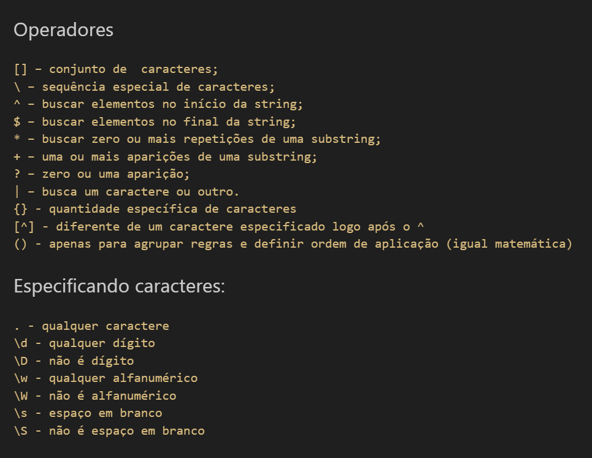

# Expressões Regulares - Regex
Expressões regulares são padrões utilizados para selecionar combinações de caracteres em uma string.  
Em Python, as expressões regulares são implementadas pelo módulo `re`.  
O módulo `re` deve ser importado para que você possa utilizar as expressões regulares.  
  
## Índice
- [regex.ipynb](regex.ipynb) - resumo sobre expressões regulares.
  
